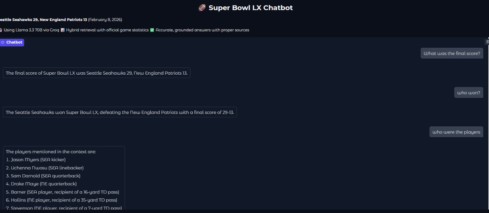

# 🏈 Sports GenAI Chatbot (Prototype)

## Overview

This project is a **GenAI-powered sports chatbot prototype** built in ~3 hours, initially inspired by **Super Bowl LX**. The goal is to provide **quick game summaries, scorecards, and key stats** for users who missed a match or want fast insights without watching the full game.

This is an **early-stage prototype**, focused on idea validation rather than a fully polished production system.

## What This Chatbot Does

* Generates **match summaries**
* Provides **basic scorecards & key stats**
* Answers natural language questions about a recent game

Currently, the bot is demonstrated using **Super Bowl data**, but the design is flexible.

## Future Scope

The chatbot can be extended to:

* Support **any sport** (football, cricket, basketball, etc.)
* Handle **any recent game**
* Provide:

  * Match summaries
  * Scorecards
  * Key moments & highlights

The long-term idea is a **single chatbot for sports updates**, powered by GenAI.

## Tech Stack (Prototype)

* Python
* GenAI / LLM-based text generation
* Jupyter Notebook for rapid prototyping

## Project Status

⚠️ **Prototype / Work in Progress**

* Built quickly to demonstrate the concept
* Model accuracy and depth will be improved in future iterations

## Screenshot

*(Sample chatbot interface)*

## How to Run (Basic)

1. Clone the repository
2. Open the Jupyter Notebook
3. Run the cells to interact with the chatbot

## Why This Project?

This project demonstrates:

* Rapid GenAI prototyping
* Applying LLMs to real-world, time-based events
* Turning unstructured sports data into **quick, user-friendly insights**

---

**Feedback and suggestions are welcome!**
